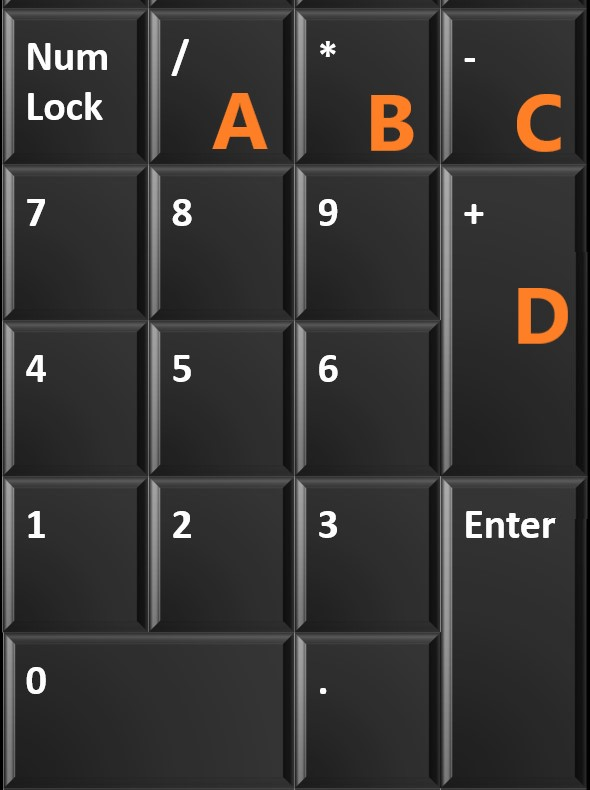
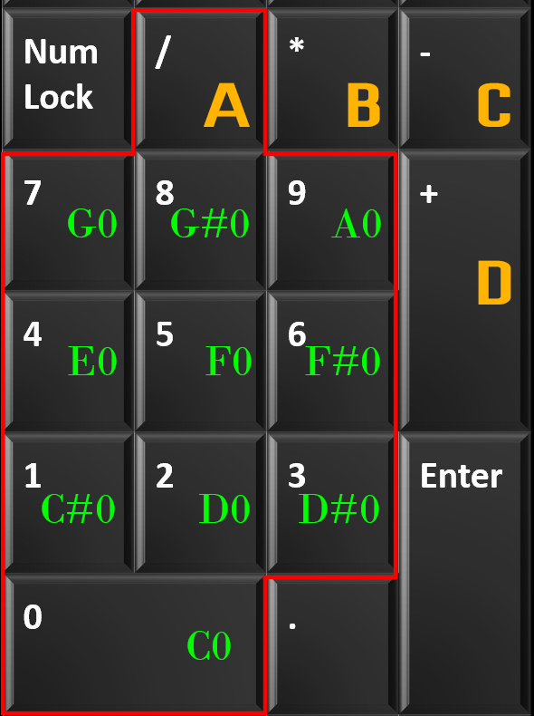
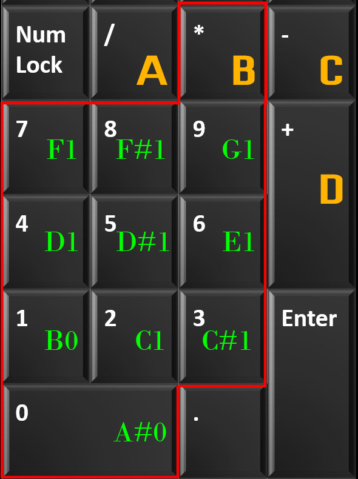
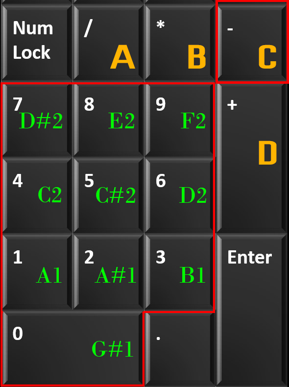
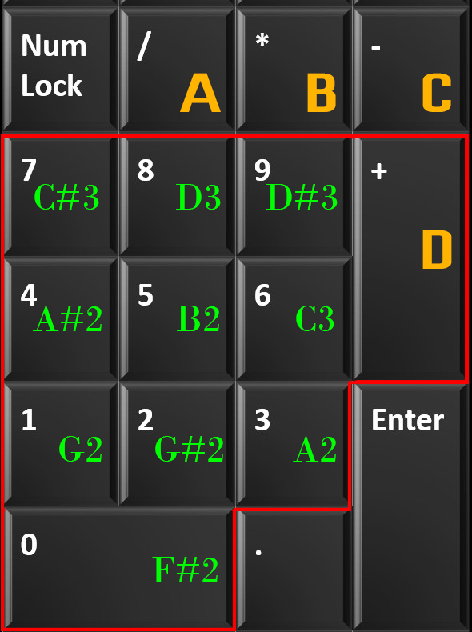

# KeyMIDI
A python Script which allows to use Numpad as MIDI Pad 

# Releases
Download KeyMIDI.py file from [here](https://github.com/goldnjohn/KeyMIDI/blob/main/KeyMidi.py)

# Features
* Numpad can be transformed into a MIDI pad
* It allows upto 40 keys (10x4) range from `C0` to `D#3` that you can assign to anything in your DAW
* Numpad is divided into 4 Sections

* Keys in the section are as follows
 
          
 
        
    
# Usage
* Install `pynput` and `rtmidi` libraries through pip3 
* Download LoopMIDI application from [here](http://www.tobias-erichsen.de/wp-content/uploads/2020/01/loopMIDISetup_1_0_16_27.zip)
* Create a virtual port inside loopMIDI
* Run `KeyMIDI.exe` 
* Enter virtual port number of loopMIDI when asked

# Dependencies
* pynput
* rtmidi

# Issues
Optimized for fast switching between keys but between section might have some latency (to be fixed in future updates)

